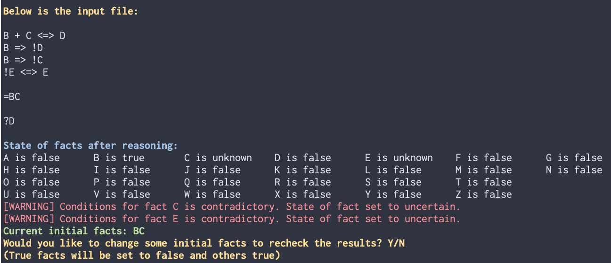

# Expert System

## Overview

This project implements an **expert system** designed to simulate the decision‑making ability of a human expert in a specific domain. The system uses a rule‑based knowledge base and a back-chaining inference engine to analyze facts provided by the user and produce logical conclusions.

The goal of this project is to demonstrate knowledge representation, logical reasoning, and automated problem solving using symbolic AI techniques.


## Features

* Rule‑based knowledge representation
* Backward chaining inference
* Fact management system
* Conflict resolution strategy
* Modular and extensible architecture


## How It Works

An expert system generally consists of three main components:

### 1. Knowledge Base

Contains domain knowledge expressed as **facts** and **rules**.

* **Facts**: Statements known to be true
* **Rules**: Logical implications in the form:

```
IF <conditions> THEN <conclusion>
```

### 2. Inference Engine

The reasoning core of the system. It applies rules to known facts to infer new facts or decisions.

Two common strategies:

* **Forward Chaining**: Starts from known facts and applies rules to derive new information until a goal is reached.
* **Backward Chaining**: Starts from a goal and works backward to determine if the goal can be satisfied.

This project uses backward chaining.

### 3. User Interface / Input Layer

Allows users to change initial facts without modifying the input file during runtime so the system can recheck conclusions.


## System Architecture

```
User Input → Fact Base → Inference Engine → Rule Evaluation → Conclusion
```

Main responsibilities:

* Parsing and storing rules
* Storing and updating facts
* Selecting applicable rules
* Executing rule logic
* Producing final output and explanations


## Installation

After git clone and enter the project folder:
```bash
git clone https://github.com/Roychrltt/expert-system.git
cd expert-system
make
```


## Usage

Run the program and provide input facts or answer system questions.

```bash
./expert_system input.txt
```

Example rule format:

```
A + B => C
C + D => E
```

Example fact input:

```
A = true
B = true
D = true
```

The system will infer whether `E` is true based on the rule chain.

## Example

The program prints the input file first to facilitate human checking. Next, the reasoning result for all 26 facts are printed. The user is then provided with the possibility to make changes to initial facts so as to recheck the result.
In the following case, the conditions for C and E are contradictory, so these facts are set to unknown. We also got an error message in red.


## Testing

Run tests to verify correctness:

```bash
make test
```

Test cases should cover:

* Simple inference
* Multi‑step reasoning
* Conflicting rules
* Edge cases (missing facts, circular dependencies)


## LICENSE

MIT
